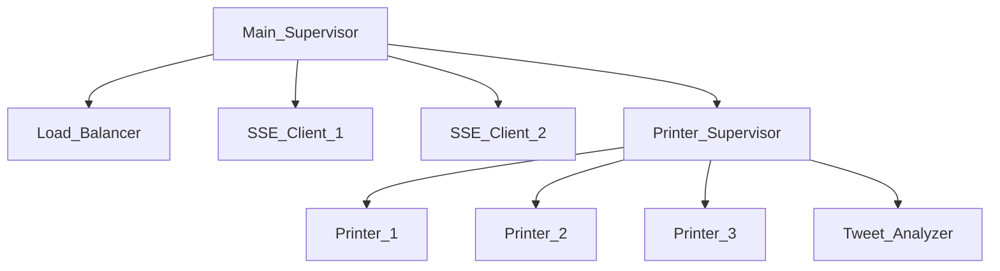
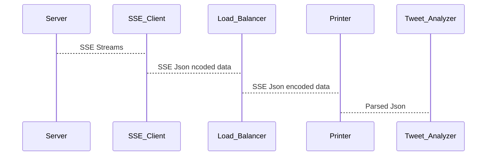

# Project 1: Stream Processing with Actors

## Docker Container
The SSE streams for this lab are available from :

```
docker run --rm -it -p 4000:4000 alexburlacu/rtp-server:faf18x
```

## Supervision Tree



## Message Flow Diagram

