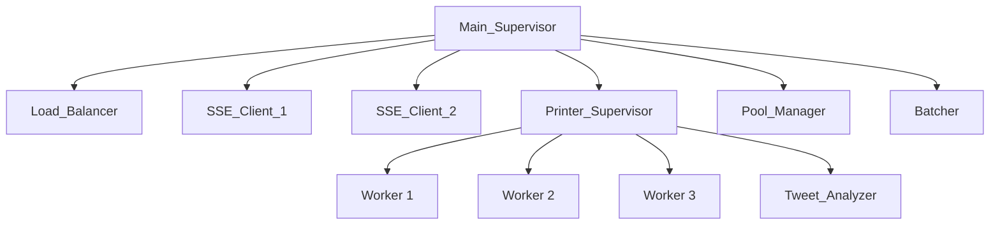

```mermaid
graph TB
    Main_Supervisor-->Load_Balancer
    Main_Supervisor-->SSE_Client_1
    Main_Supervisor-->SSE_Client_2
    Main_Supervisor-->Printer_Supervisor
    Main_Supervisor-->Pool_Manager
    Main_Supervisor-->Batcher
    Printer_Supervisor-->Worker1["Worker 1"]
    Printer_Supervisor-->Worker2["Worker 2"]
    Printer_Supervisor-->Worker3["Worker 3"]
    Printer_Supervisor-->Tweet_Analyzer
```